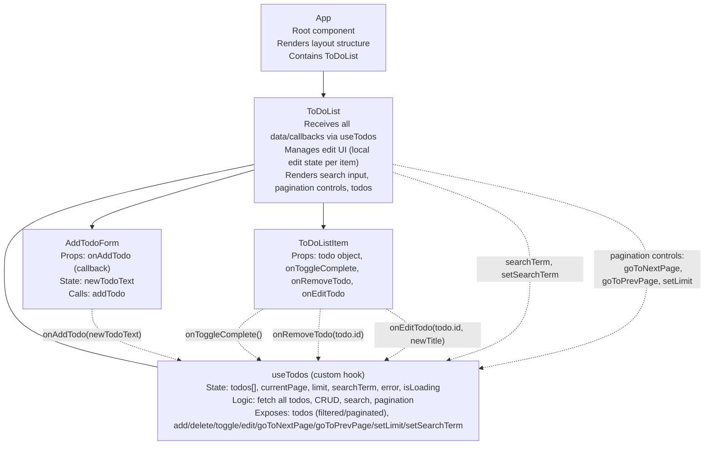

# Diagram

# Explanation

useTodos (custom hook): інкапсулює весь стан і логіку додатку — зберігає масив задач todos, параметри пошуку, пагінації, індикатори завантаження та помилки; реалізує отримання даних з API, фільтрацію, пагінацію, додавання, видалення, редагування та перемикання виконання задач; повертає відфільтрований і пагінований масив задач, а також усі функції для керування даними.

ToDoList: не містить власного стану задач, отримує всі дані та callback-функції з кастомного хуку useTodos; відповідає за UI — поле пошуку, контролі пагінації, список задач, локальний стан для редагування задач; передає callback-и дочірнім компонентам для взаємодії з хуком.

AddTodoForm: керує полем введення newTodoText і передає нову справу у useTodos через onAddTodo.

ToDoListItem: керує локальною подією кліку для завершення справи, видалення та редагування; отримує дані задачі та callback-и для дій через пропси; реалізує UI для чекбоксу, кнопок редагування/збереження/видалення, інпуту для редагування.

App: не має стану, служить лише обгорткою і рендерить ToDoList.
